# GitHub Issue Graph

I built this React application as a fun project using [Cursor](https://www.cursor.com/) to help me visualize my GitHub project issues and pull requests through interactive charts and graphs. It helps me understand my team's progress, performance patterns, and code review behaviors. I use it to track sprint velocity, analyze workload distribution, and identify trends in our development process. You are welcome to use it. 

It is hosted at https://vivekkodira.github.io/github-issue-graph/

## Features

- Interactive visualization of GitHub issues and pull requests
- Team performance analysis
- Code review insights
- Sprint velocity tracking
- Issue dependency graph
- Automated insights generation

## Demo


## How to Use

1. Enter your GitHub repository details in the configuration section:
   - Repository Owner
   - Repository Name
   - Project ID (optional)
   - GitHub Token (required for API access)

2. Click the "Render" button to fetch and display your repository data

## How it works
* If the user has entered a projectID, GraphQL calls are made to Github's API endpoints
* If the user has only entered a repository, REST calls are made instead
* The response is normalised into a flat array & stored in localStorage
* This flattened array is then parsed & massaged by the various graphs to display various visualisations

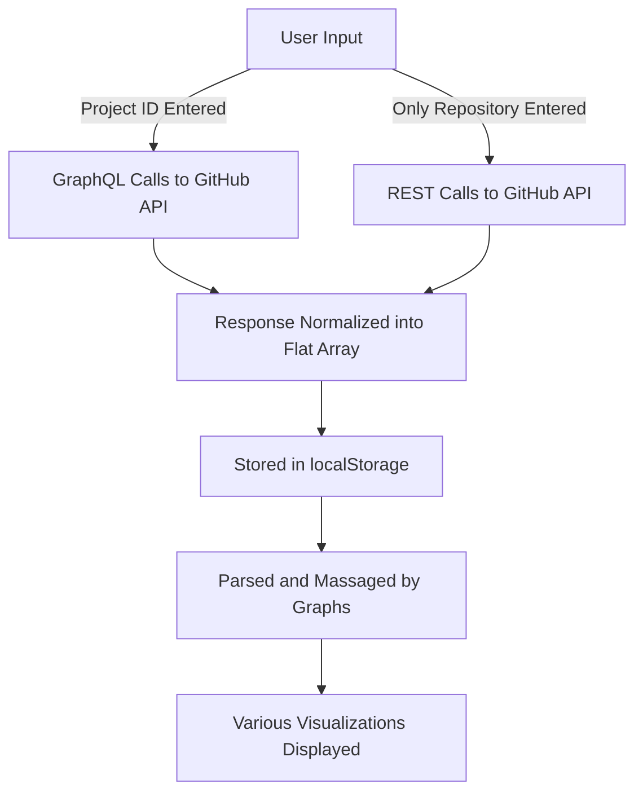
```mermaid
flowchart TD
    A[User Input] -->|Project ID Entered| B[GraphQL Calls to GitHub API]
    A -->|Only Repository Entered| C[REST Calls to GitHub API]
    B --> D[Response Normalized into Flat Array]
    C --> D
    D --> E[Stored in localStorage]
    E --> F[Parsed and Massaged by Graphs]
    F --> G[Various Visualizations Displayed]
```

## Dashboard Tabs

### Project Overview
- **Completion Charts**
  - Planned Task Completion Count
  - Planned Task Completion Effort
  - Overall Task Completion
- **Sprint Velocity Chart**: Track team's velocity across sprints
- **Effort Prediction Chart**: Predict project completion timeline based on current velocity
- **Status Chart**: View issue status distribution
- **Sprint Chart**: Analyze sprint-wise task distribution

### Team Analysis
- **Assignee Charts**
  - Task distribution by assignee
  - Pie charts showing workload distribution
  - Line charts tracking assignee performance over time
- **Reviewer Charts**
  - Review workload distribution
  - Reviewer performance trends
- **Author Charts**
  - PR creation trends by author
  - Author contribution patterns

### Pull Requests
- **PR Review Chart**: Review patterns and statistics
- **PR Lifecycle Chart**: Time taken for PR reviews and merges
- **Code Churn Chart**: Code changes and modifications
- **Review Quality Chart**: Quality metrics for code reviews
- **Review Word Cloud**: AI-enhanced visualization of common terms in PR reviews

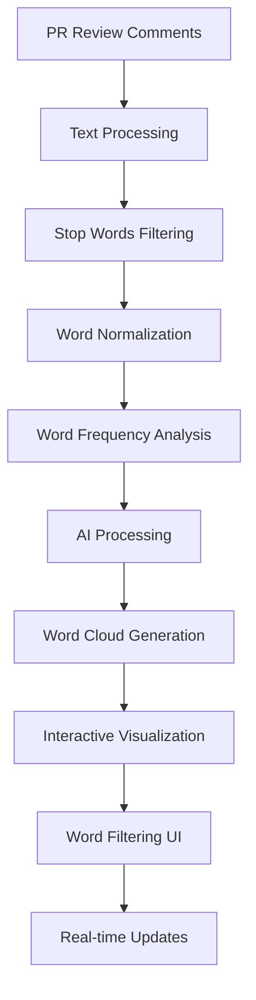
```mermaid
flowchart TD
    A[PR Review Comments] --> B[Text Processing]
    B --> C[Stop Words Filtering]
    C --> D[Word Normalization]
    D --> E[Word Frequency Analysis]
    E --> F[AI Processing]
    F --> G[Word Cloud Generation]
    G --> H[Interactive Visualization]
    H --> I[Word Filtering UI]
    I --> J[Real-time Updates]
```

### Issue Graph
- Interactive visualization of issue dependencies
- Network graph showing relationships between issues
- Filter and explore issue connections

### Insights
- Automated insights generation based on data analysis
- Color-coded insights (green for positive trends, red for negative)
- Key metrics and patterns highlighted

## Limitations

* Much of the code in the charts was generated using [Cursor](https://www.cursor.com/). There is scope for better design & refactoring.

* This application assumes certain custom fields are configured in your GitHub repository:
  - **Sprint**: Used to group tasks into sprints (e.g., "Sprint-1", "Sprint-2")
  - **Size**: Used for task size estimation (e.g., "S", "M", "L")
  - **Estimate (days)**: Planned effort in days
  - **Actual (days)**: Actual effort spent in days

These fields are used for:
- Effort estimation and tracking
- Sprint velocity calculations
- Workload distribution analysis
- Performance trend insights

If your repository doesn't use these custom fields, some charts and insights may not work as expected. You can configure these field mappings in the project configuration.

## Getting Started

1. Clone the repository
2. Install dependencies:
   ```bash
   npm install
   ```
3. Run:
   ```bash
   npm run dev
   ```

## Debug Mode

The application includes a debug mode for troubleshooting and data inspection. Debug mode is controlled via browser localStorage, so you can enable/disable it without code changes or rebuilding.

### Enable Debug Mode

1. Open your browser's developer console (F12 or Cmd+Option+I on Mac)
2. Run the following command:
   ```javascript
   localStorage.setItem('ENABLE_DEBUG', 'true')
   ```
3. Refresh the page
4. Click "Render" to fetch data

### What Debug Mode Does

When enabled, debug mode will:
- Log the first issue's data structure to the console
- Display all available field names
- Automatically download a `flattened_tasks_debug.json` file with the complete data
- Log raw GraphQL responses (if using project queries)

### Disable Debug Mode

To disable debug mode, run this in the browser console:
```javascript
localStorage.removeItem('ENABLE_DEBUG')
```

### Use Cases

Debug mode is useful for:
- Inspecting the data structure of your issues
- Verifying custom fields are being fetched correctly
- Troubleshooting GraphQL queries
- Understanding the flattened data format
- Testing new custom field configurations

## Screenshots

### Project Overview
#### Track project completion
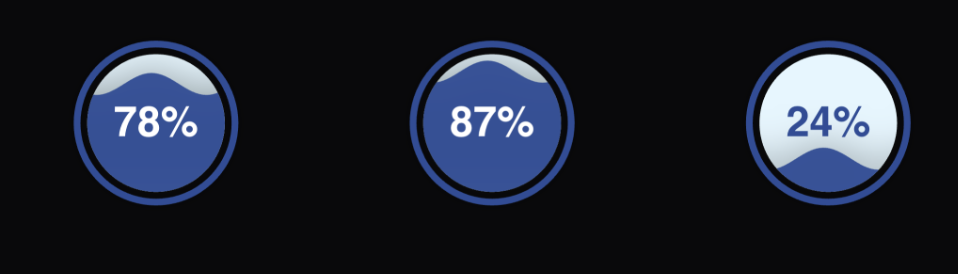

####  sprint velocity
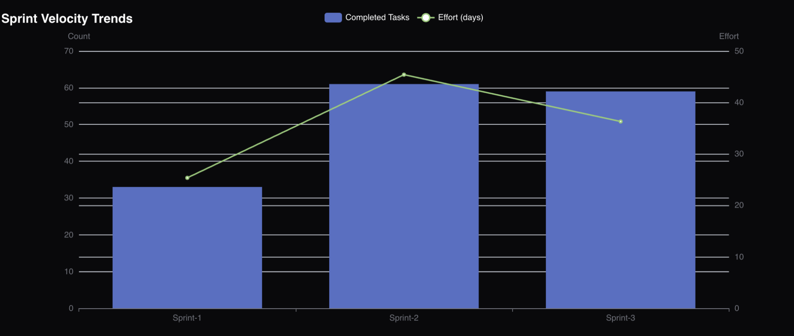

#### effort prediction
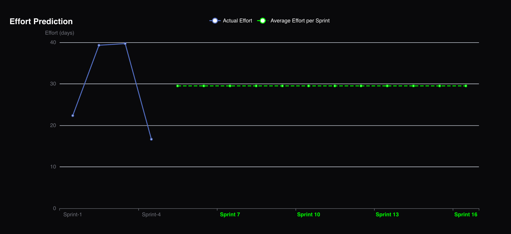

### Team Analysis

#### Issue categorisation By person
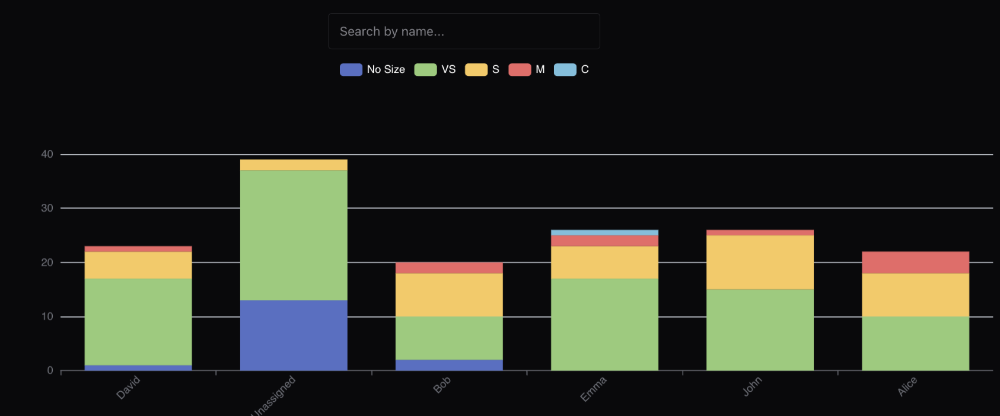

#### Issue categorisation By person Pie chart
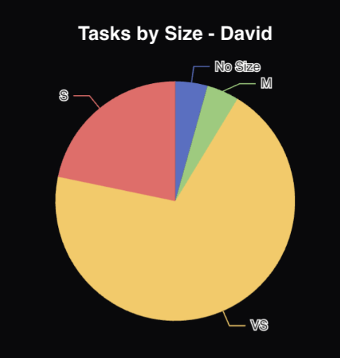


#### Efforts by person per sprint
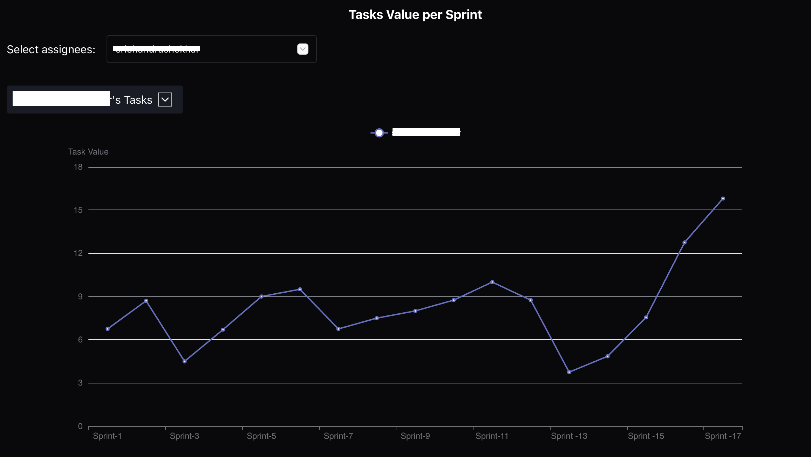

#### Review comments recieved
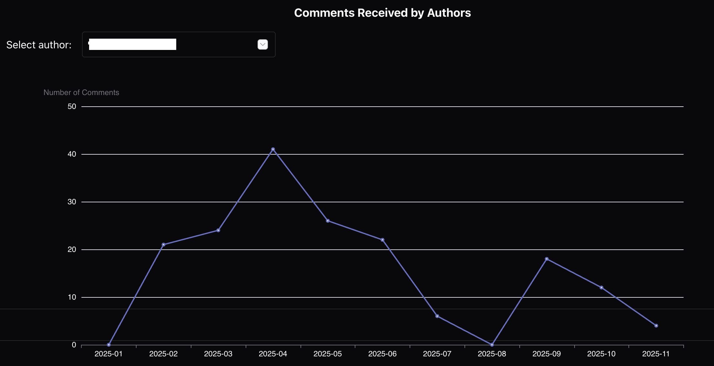

#### Review comments given
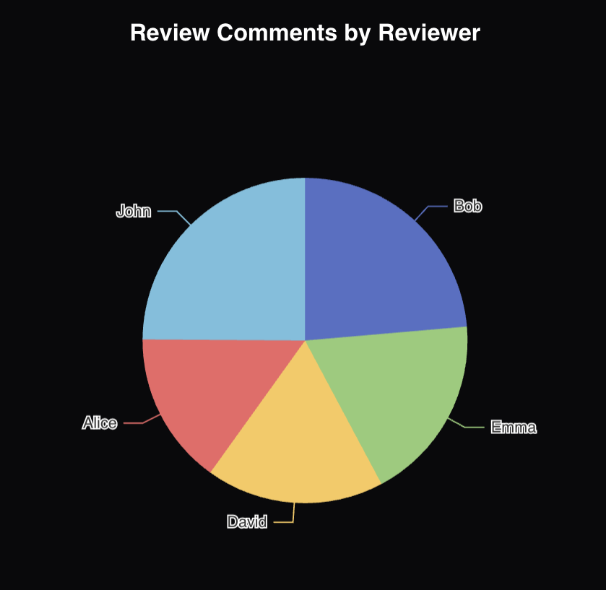


### Pull Requests

#### Pull Request Complexity vs Time to review
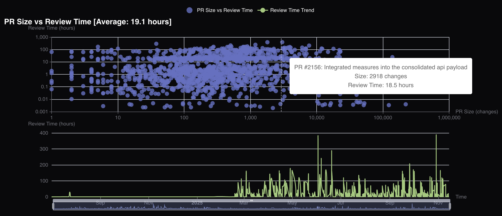

#### Code churn over time
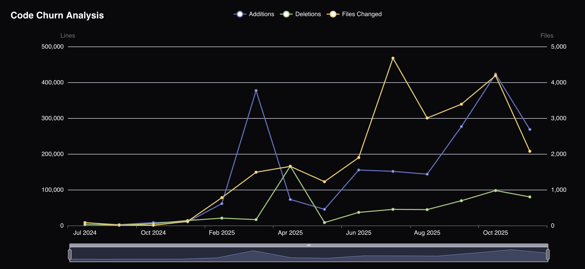

#### Review quality
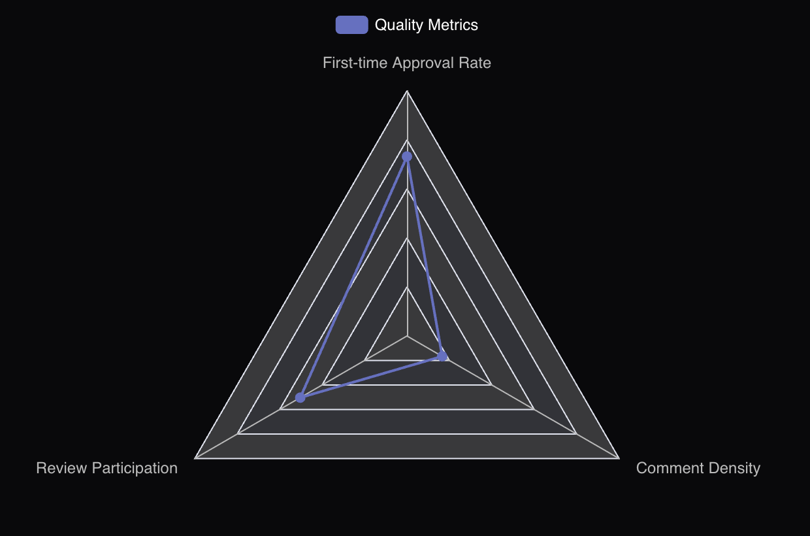

#### Review comments sentence cloud
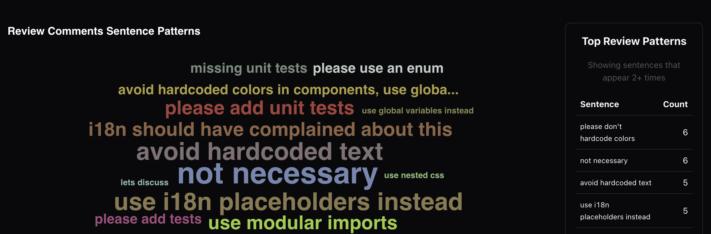

#### Pull Request Submission Frequency
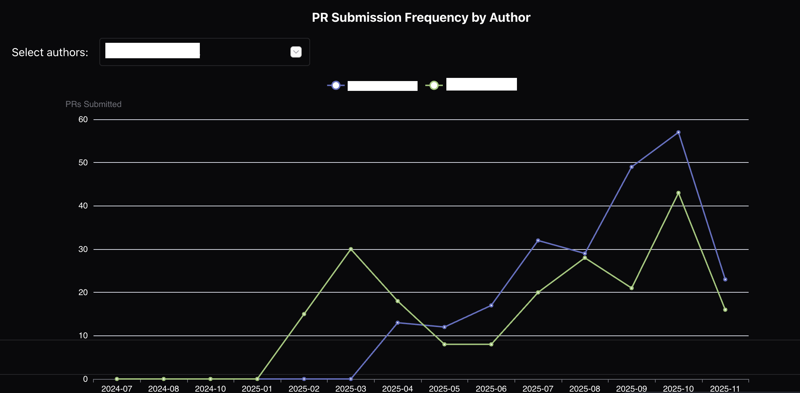


#### Pull Request (Days between PRs)
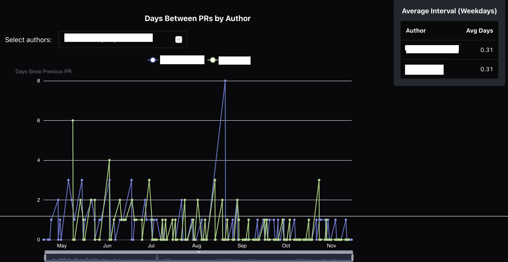


### Issues Analysis

#### Issue search & categorisation
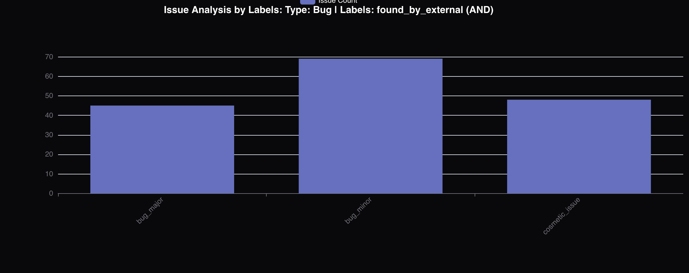


#### Issue Creation timeline

* Example: Bugs found by testers
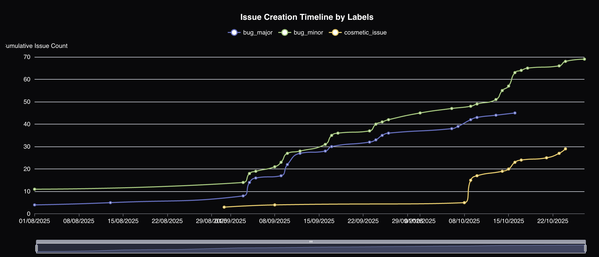

* Example: Change requests
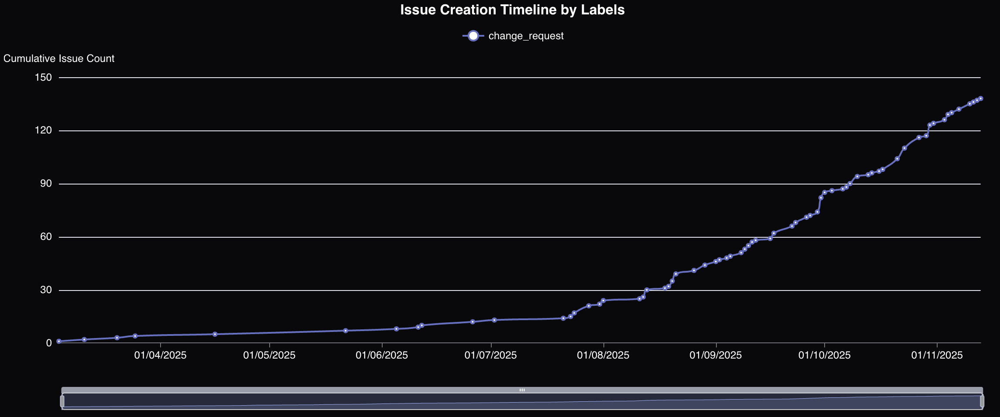


#### Visualize issue dependencies and relationships in an interactive network graph
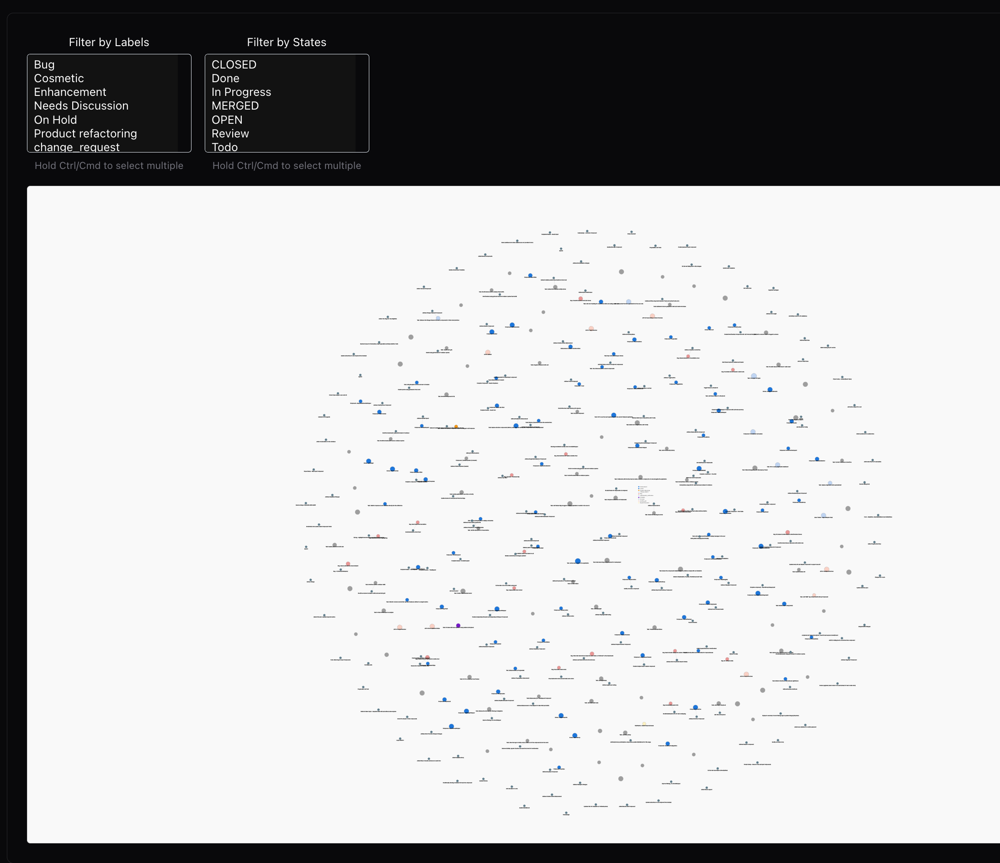
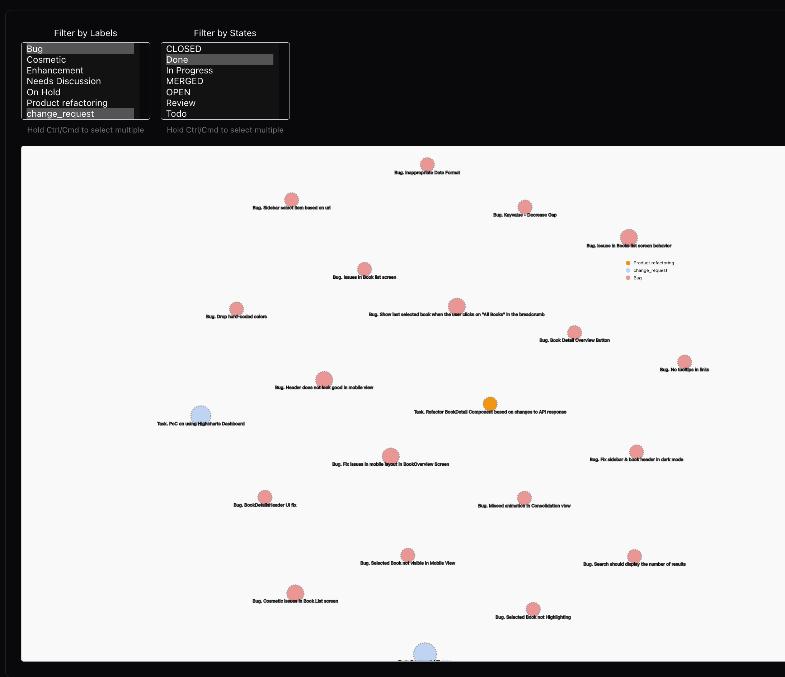

### Insights
*Get automated, color-coded insights about team performance and project trends*
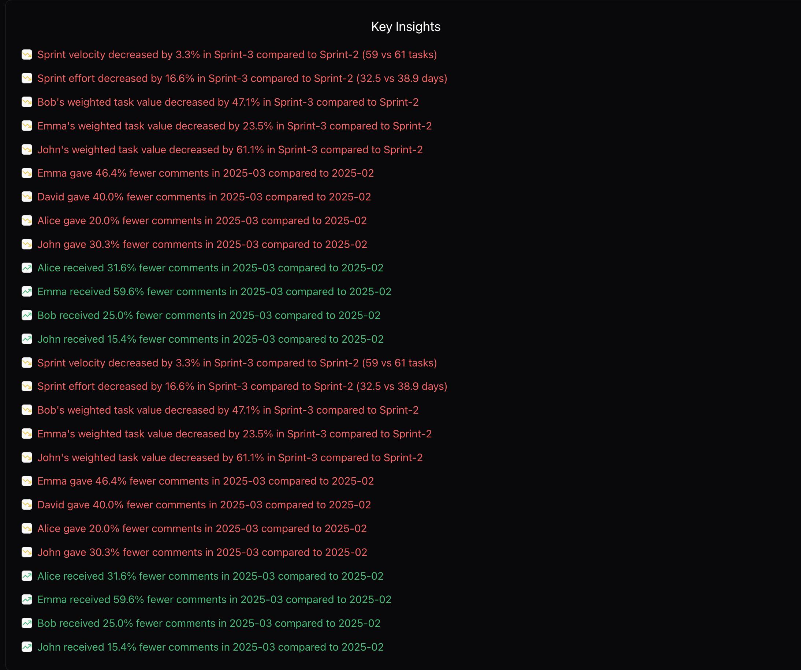